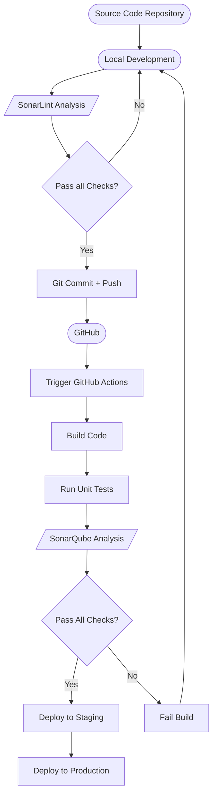

# G1T3 Project (name still TBC)

## 📹 Video Setup Instructions
After you have downloaded all the necessary [prerequisites](#prerequisites), run docker desktop and follow the instructions.

Visual guide for the lazy developers:

https://github.com/user-attachments/assets/360b0e55-d038-4fdd-9af1-a2011a716650

## Table of Contents
1. [Introduction](#introduction)
2. [Project Structure](#project-structure)
3. [Technologies Used](#technologies-used)
4. [Prerequisites](#prerequisites)
5. [Setup and Installation](#setup-and-installation)
6. [Running the Application](#running-the-application)
7. [Development](#development)
8. [Testing](#testing)
9. [Deployment](#deployment)
10. [Contributing](#contributing)
11. [License](#license)

## Introduction

Welcome to the G1T3 project (Name TBC pls come up and update once we think of smt). This application is a full-stack solution that combines a Spring Boot backend with a Next.js frontend, orchestrated using Docker for easy development and deployment, (we will probably host it on AWS but not cfm)

Members:
1. (Product Owner)
2. (Scrum Master)
3. 
4. 
5. 
6. 

**Brief description**

## CI/CD Pipeline (TBC)


## DB Schema


Link:
https://dbdiagram.io/d/G1-T3-66cdd59ecf8e2d1d1cffe232

## Project Structure

The project is organized into three main components:

```
g1-t3/
├── backend/             # Spring Boot application
│   ├── src/
│   ├── pom.xml
│   └── Dockerfile
│   └── ...
├── frontend/            # Next.js application
│   ├── src/
│   ├── public/
│   ├── package.json
│   └── Dockerfile
│   └── ...
├── database/            # Database-related files
├── docker-compose.yml
└── README.md
```

## Technologies Used
### Stack:
<div align="center">
  <div style="display: flex; flex-direction: column; align-items: center;">
    <div><strong>P</strong></div>
    <div>PostgresSQL: Relational Database</div>
  </div>
  <div style="display: flex; flex-direction: column; align-items: center;">
    <div><strong>O</strong></div>
    <div>OpenShift: Microservice Management/ Orchestration</div>
  </div>
  <div style="display: flex; flex-direction: column; align-items: center;">
    <div><strong>R</strong></div>
    <div>React: State Management</div>
  </div>
  <div style="display: flex; flex-direction: column; align-items: center;">
    <div><strong>N</strong></div>
    <div>Next.js: Frontend</div>
  </div>
  <div style="display: flex; flex-direction: column; align-items: center;">
    <div><strong>S</strong></div>
    <div>SpringBoot: Backend</div>
  </div>
</div>

### At a glance:
- Backend:
    - Java 17
    - Spring Boot 3.x
    - Spring Data JPA
    - Spring Security
- Frontend:
    - Next.js 13
    - React 18
    - TypeScript
- Database:
    - TBC but probably MySQL 8.0 or PostgresSQL
- DevOps:
    - Docker
    - Docker Compose

## Prerequisites

Before you begin, please ensure you have the following installed on your system:
- Docker
- Docker Compose
- Java Development Kit (JDK) 17 (for local development)
- Node.js 18 or later (for local development)
- npm or yarn (for local development)
- PostgreSQL

## Setup and Installation

1. Clone the repository:
     ```
     git clone https://github.com/ceewaigithub/g1-t3.git
     cd g1-t3
     ```

2. Configure environment variables:
    ```sh
    DB_USERNAME=postgres
    DB_PASSWORD=<insert-password>

    POSTGRES_PASSWORD=$DB_PASSWORD
    POSTGRES_USER=$DB_USERNAME
    POSTGRES_DB=g1t3db

    SPRING_DATASOURCE_USERNAME=$DB_USERNAME
    SPRING_DATASOURCE_PASSWORD=$DB_PASSWORD
    SPRING_DATASOURCE_URL=jdbc:postgresql://db:5432/$POSTGRES_DB
    ```
    - Create a `docker.env` file in the root directory
    - Add necessary environment variables (e.g., database credentials, API keys)
    

3. Build and start the Docker containers:
     ```
     docker-compose up --build
     ```

## Running the Application

After completing the setup, you can access the application at:
- Frontend: [http://localhost:3000](http://localhost:3000)
- Backend API: [http://localhost:8080](http://localhost:8080)

To stop the application, use `Ctrl+C` in the terminal where Docker Compose is running, or run:
```
docker-compose down
```

## Development

### Backend Development
For local backend development:
1. Navigate to the `backend` directory
2. Run `./mvnw spring-boot:run` (or `mvn spring-boot:run` if you're not using the Maven wrapper)

### Frontend Development
For local frontend development:
1. Navigate to the `frontend` directory
2. Run `npm install` (or `yarn install`)
3. Start the development server with `npm run dev` (or `yarn dev`)

### Code Structure
- Follow the package structure as outlined in the [Project Structure](#project-structure) section.
- Organize backend code into layers: controllers, services, repositories, and models.
    - Controller: For REST controllers
    - Service: For business logic
    - Repository: For database interactions
    - Model: For entity classes
- Place cross-cutting concerns in the `common` package.

## Testing

### Backend Testing
To run backend tests:
```
cd backend
./mvnw test
```

### Frontend Testing
To run frontend tests:
```
cd frontend
npm run test
```

## Deployment

TBC - prob AWS

## License

This project is licensed under the [MIT License](LICENSE).
